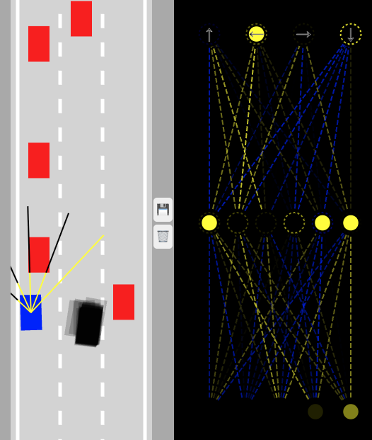

# Self-Driving Car Project 🚗🧠

A browser-based machine learning simulation demonstrating evolutionary neural networks controlling self-driving cars — built purely with **JavaScript**.

Inspired by the amazing [Self-Driving Car course by Radu Mariescu-Istodor](https://www.youtube.com/watch?v=NkI9ia2cLhc&list=PLB0Tybl0UNfYoJE7ZwsBQoDIG4YN9ptyY).

---

## 💡 About This Project

This project uses evolutionary neural networks to train virtual cars to navigate a road without collisions. It runs entirely in the browser — no backend or complicated setup required.

It combines raycasting sensors, genetic mutation, and live network visualization to demonstrate core ML concepts in an accessible, hands-on way.

---

## 🚀 Getting Started

Open the `index.html` file in your browser and watch 1000 cars learn to drive through generations of evolution.

---

## 🔧 How It Works

### Evolutionary Algorithm

* Population of 1000 cars, each controlled by a simple feedforward neural network.
* Five distance sensors per car use raycasting and segment intersection algorithms.
* Neural networks receive sensor inputs and output control signals: accelerate, brake, steer left, steer right.
* The car that travels furthest along the road is selected as the best performer each generation.

### Save & Mutate

Click the **💾 icon** to save the best-performing car’s neural network (`bestBrain`) to local storage. On page reload:

* One car retains the saved network.
* Remaining cars receive mutated versions, enabling gradual improvement through generations.

---

## 🧠 Neural Network Architecture

* 5 input neurons (sensor distances)
* 1 hidden layer with 6 neurons
* 4 output neurons for directional controls
* Full live visualization of network activations during training

---

## ⚙️ Features

* Pure JavaScript — no external ML libraries
* Raycasting-based collision detection
* Genetic mutation for evolutionary learning
* Save and restore trained networks using browser `localStorage`
* Fully client-side with interactive visualization

---

## 🙏 Acknowledgements

Special thanks to [Radu Mariescu-Istodor](https://www.youtube.com/watch?v=NkI9ia2cLhc&list=PLB0Tybl0UNfYoJE7ZwsBQoDIG4YN9ptyY) for the inspiring course that sparked this project.

